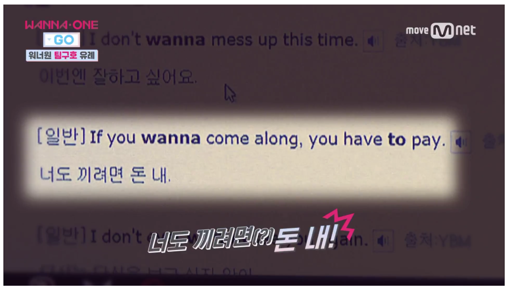

🤑 🤪 Wellcome!! You have to Pay 🤪 🤑 
===
</img>  </img>

## I WANT..?🙏🙏
Back End Developer

## I CAN DO!! 💪💪
### Server
     

### Database

### Cloud Service
   

### Other Stack
        

## MY Record^^ 📜
- 2016.03 ~ 2022.02 Dongseo University    
  major : Computer Science and Engineering   
  minor : AI Engineering

- 2019.09.10 AWS Cloud in Busan DeepRacer League 2019 3rd place 🥉

- 2021.10 Development a Meal Support System for the Visually Impaired Using YOLO Algorithm
  https://www.kci.go.kr/kciportal/ci/sereArticleSearch/ciSereArtiView.kci?sereArticleSearchBean.artiId=ART002772204

- 2022 NAVER Connect Foundation boostcamp Web & Mobile 7th Web FullStack ~   

# Thank YOU :) 😁🖐

 

<!--
**youhavetopay/youhavetopay** is a ✨ _special_ ✨ repository because its `README.md` (this file) appears on your GitHub profile.

Here are some ideas to get you started:

- 🔭 I’m currently working on ...
- 🌱 I’m currently learning ...
- 👯 I’m looking to collaborate on ...
- 🤔 I’m looking for help with ...
- 💬 Ask me about ...
- 📫 How to reach me: ...
- 😄 Pronouns: ...
- ⚡ Fun fact: ...
-->
